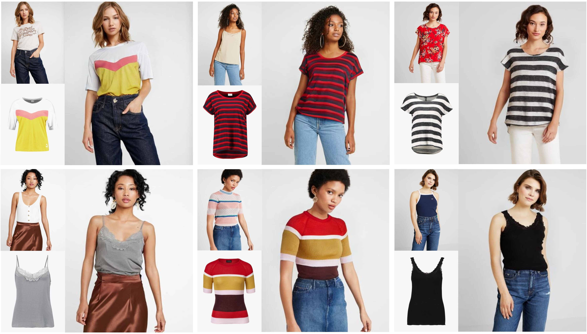

# [CVPR2024] TPD

This repository is the official implementation of [TPD](https://arxiv.org/abs/2404.01089)

> **Texture-Preserving Diffusion Models for High-Fidelity Virtual Try-On**
>
> Xu Yang, Changxing Ding, Zhibin Hong, Junhao Huang, Jin Tao, Xiangmin Xu

&nbsp;

## TODO List

- [x] Release inference code
- [x] Release model weights
- [x] Release training code
- [x] Release evaluation code


## Environments

```
conda env create -f environment.yml
conda activate TPD
```


## Data Preparation

### Weights

Download the pretrained [checkpoint](https://drive.google.com/file/d/1twsjZ0kQkyFdfLcw8EYmvQmsRIgqnI3o/view?usp=sharing) and save it in the checkpoints folder like: 

```
checkpoints
|-- release
	|-- TPD_240epochs.ckpt
```


### Datasets

Download the VITON-HD dataset from [here](https://github.com/shadow2496/VITON-HD).

You should copy the test folder for validation and the dataset structure should be like: 

```
datasets/VITONHD/
test | train | validation(copied from test)
|-- agnostic-mask
|-- agnostic-v3.2
|-- cloth
|-- cloth_mask
|-- image
|-- image-densepose
|-- image-parse-agnostic-v3.2
|-- image-parse-v3
|-- openpose_img
|-- openpose_json
```


## Inference

Refer to [commands/inference.sh](./commands/inference.sh)


## Training

### Prepare

We utilize the pretrained Paint-by-Example as initialization, and increase it's first conv-layer from 9 to 18 channels (zero initiated).  Please download the [pretrained model](https://github.com/Fantasy-Studio/Paint-by-Example) first and save it in the checkpoints folder. Then run [utils/rm_clip_and_add_channels.py](./utils/rm_clip_and_add_channels.py) to add input channels of the first conv-layer and remove CLIP module. The final checkpoints folder structure is like: 

```
checkpoints
|-- original
	|-- model.ckpt
	|-- mode_prepared.ckpt	
```

### Commands

Refer to [commands/train.sh](./commands/train.sh)


## Evaluation

### Prepare 

LPIPS: https://github.com/richzhang/PerceptualSimilarity

FID: https://github.com/mseitzer/pytorch-fid

Run [utils/generate_GT.py](./utils/generate_GT.py) to generate GT images with 384*512 resolution


### Commands

Refer to  [calculate_metrics/calculate_metrics.sh](./calculate_metrics/calculate_metrics.sh)


## Acknowledgements

Thanks to [Paint-by-Example](https://github.com/Fantasy-Studio/Paint-by-Example), our code is heavily borrowed from it. 


## Citation

```
@misc{yang2024texturepreserving,
      title={Texture-Preserving Diffusion Models for High-Fidelity Virtual Try-On}, 
      author={Xu Yang and Changxing Ding and Zhibin Hong and Junhao Huang and Jin Tao and Xiangmin Xu},
      year={2024},
      eprint={2404.01089},
      archivePrefix={arXiv},
      primaryClass={cs.CV}
}
```